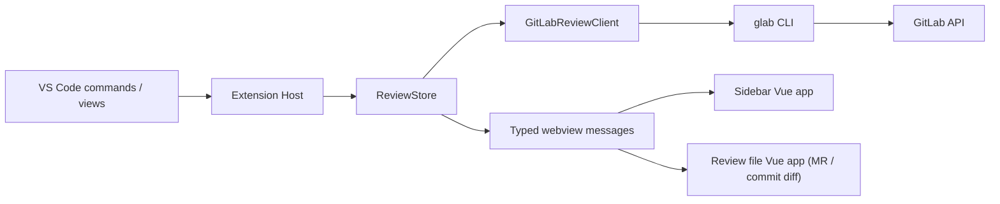

# GitLab Review Workspace

GitLabのMerge Requestを、VS Codeから離れずに確認・レビューするための拡張機能です。変更ファイル、コミット、ディスカッション、ローカル編集を1つのレビュー環境にまとめます。

> [!NOTE]
> 現在はGitHub ReleasesでVSIXを配布しています。Visual Studio Marketplaceには未公開です。

## 主な機能

- Activity Barの`GitLab Review`からMRを選択・更新
- 変更ファイルと差分統計をツリー表示
- MR全体またはコミット単位で変更を確認
- コミット差分もレビュー差分と同じファイルビューアで選択・コメント
- 差分行のクリック・ドラッグ選択からディスカッションを作成
- コメントの返信、編集、Resolve/Reopen
- GitLab Todo通知から対象MRへ移動
- ソース/ターゲットブランチのファイルツリーを閲覧
- レビュー用のローカル編集を保存し、MR差分と区別して表示
- 通信失敗時にも直近のレビューを表示する限定キャッシュ

## 画面構成

- **Sidebar**: MR概要、変更ファイル、コミット、レビュースレッド、通知
- **Review file panel**: MR差分・コミット差分、ローカル差分、インラインディスカッション、ローカル編集
- **Branch file editor**: GitLab上のブランチファイルを読み取り専用で表示

## 必要環境

- VS Code 1.95以降
- Node.jsとnpm
- [GitLab CLI (`glab`)](https://gitlab.com/gitlab-org/cli)
- `glab auth login`済みのGitLabアカウント

拡張機能はGitLabトークンを保存しません。認証は`glab`とOSの資格情報ストアに委ねます。

## インストール

1. [GitHub Releases](https://github.com/ota-takeru/gitlab-review-workspace/releases)から最新の`.vsix`をダウンロードします。
2. VS CodeのExtensionsビューで右上の`…`を開き、`Install from VSIX...`を選択します。
3. ダウンロードしたVSIXを選択し、必要に応じてVS Codeを再読み込みします。

コマンドラインからインストールする場合は次を実行します。

```bash
code --install-extension gitlab-review-workspace-0.0.1.vsix
```

インストール後、`glab auth login`を実行してからActivity Barの`GitLab Review`を開いてください。

## セットアップ

```bash
npm ci
npm run check
npm test
```

VS Codeでこのフォルダを開き、`Run and Debug`から`Run Extension`を実行します。起動したExtension Development HostでActivity Barの`GitLab Review`を開いてください。

`glab`が未ログインの場合は、サイドバーの`Sign in`から統合ターミナルでログインを開始できます。

## 設定

| 設定 | 既定値 | 用途 |
| --- | --- | --- |
| `gitlabReview.gitlabBaseUrl` | `https://gitlab.com` | GitLabインスタンスURL（任意。カスタムドメイン、ポート、サブパスに対応） |
| `gitlabReview.projectId` | 空 | 初期表示するプロジェクトIDまたはURLエンコード済みパス |
| `gitlabReview.mergeRequestIid` | 空 | 初期表示するMR IID |

`projectId`と`mergeRequestIid`を両方設定しない場合は、更新日時が最も新しい自分のopen MRを初期表示します。

`gitlabReview.gitlabBaseUrl`を設定しない場合は、`glab auth status --all`で認証済みのホストを自動検出します。複数のホストがある場合は、ワークスペースのGitリモートと一致するホストを優先します。必要に応じて、`https://gitlab.example.com:8443/gitlab`のようなURLを明示設定することもできます。

## 開発コマンド

| コマンド | 用途 |
| --- | --- |
| `npm run check` | Extension HostとVueの型チェック。通常の編集後に最初に実行 |
| `npm run compile` | Hostコードと3つのWebviewをビルド |
| `npm test` | クリーンビルド後に全Nodeテストを実行 |
| `npm run watch` | HostとWebviewを監視ビルド |
| `npm run storybook -- --no-open` | UI状態カタログを`localhost:6006`で起動 |
| `npm run test:storybook` | Chromiumでstory・interaction・a11yテストを実行 |
| `npm run build:storybook` | Storybookのproduction build |
| `npm run clean` | `out/`を削除 |

`out/`と`media/webview/`のJavaScript/CSSは生成物です。直接編集せず、`src/`または`webview/`を変更して再ビルドしてください。

## プロジェクト構成

```text
src/
  extension.ts            VS Code拡張のエントリーポイント
  reviewStore.ts          MR状態、更新、キャッシュ、楽観的更新
  gitlabApi.ts            glab経由のGitLab APIアクセス
  sidebarProvider.ts      Sidebar Webviewのホスト
  reviewFilePanel.ts      レビューファイルパネルのホスト
  commitDiffPanel.ts      コミット差分パネルのホスト
  webviewProtocol.ts      HostとWebview間のメッセージ契約
  test/                   Nodeテスト
webview/
  sidebar/                Sidebar Vueアプリ
  review-file/            レビュー差分Vueアプリ
  commit-diff/            コミット差分Vueアプリ
  common/                 共通コンポーネント、テーマ、VS Code APIラッパー
media/
  gitlab-review.svg       Activity Barアイコン
  webview/                Vite生成物
docs/
  DEVELOPMENT.md          開発・デバッグ・検証手順
  UI_DESIGN.md            UI設計契約と視覚QA基準
  CODEX_TASKS.md          新規Codexチャット用の依頼テンプレート
```

## アーキテクチャ



HostとWebview間では`src/webviewProtocol.ts`の型付きメッセージのみを使います。HTML断片や認証情報をWebviewへ渡さないでください。

## Codexで作業する場合

リポジトリ直下の[`AGENTS.md`](./AGENTS.md)は、新規Codexチャットで自動的に読み込まれる永続ガイダンスです。タスク固有の目的、再現手順、制約、完了条件だけを新しいチャットで追加してください。

依頼文の例は[`docs/CODEX_TASKS.md`](./docs/CODEX_TASKS.md)にあります。UI変更ではスクリーンショットと対象状態を添付し、実装前後のlight/dark比較を依頼するのが推奨です。

## 詳細ドキュメント

- [開発・検証ガイド](./docs/DEVELOPMENT.md)
- [UIデザイン契約](./docs/UI_DESIGN.md)
- [Storybook・エージェントUI検証](./docs/STORYBOOK.md)
- [Codexタスクテンプレート](./docs/CODEX_TASKS.md)
