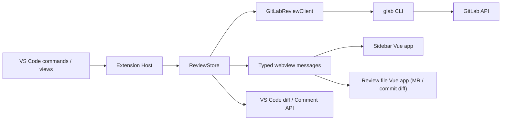

# GitLab Review Workspace

**English** | [日本語](./README.ja.md)

GitLab Review Workspace is a VS Code extension for reviewing GitLab Merge Requests without leaving the editor. It brings changed files, commits, discussions, and local review edits into one focused review environment.

> [!NOTE]
> GitLab Review Workspace is an unofficial community extension and is not an official product of GitLab Inc.

## Features

- Select and refresh Merge Requests from the `GitLab Review` Activity Bar view
- Browse changed files and diff statistics in a tree
- Review the whole MR or inspect changes commit by commit
- Detect new pushes and compare only the changes added since the previous head
- Inspect historical commit diffs and jump back to the current MR diff for commenting
- Create discussions by clicking or selecting lines in a diff
- Open MR changes in VS Code's native diff editor and use the Comment API for discussions and replies
- Reply to comments, edit comments, and Resolve/Reopen discussions
- Filter changed files by path and state, including new-push changes, unresolved discussions, and local edits
- Search review comments by body, author, or file path
- Open MRs directly from GitLab Todo notifications
- Browse source and target branch file trees
- Save local review edits separately from the MR diff
- Keep a limited cached copy of the latest review for temporary network failures

## Review surfaces

- **My work**: choose an MR from work that needs your attention
- **Sidebar**: navigate changed files, commits, and review threads for the selected MR
- **VS Code diff editor**: the primary review surface, with native code navigation and inline discussions through the Comment API
- **Review file panel (Legacy Viewer)**: review MR diffs, commit diffs, local diffs, inline discussions, and local edits
- **Branch file editor**: browse files from GitLab branches in read-only mode

Selecting a changed file or review thread in the Sidebar opens the file in VS Code's native diff editor and reveals the relevant line. The previous Review file panel remains available through `GitLab Review: Open Review File in Legacy Viewer`.

Comment inputs in the native diff editor support Markdown. Images can be pasted directly into a comment input, which uploads them to GitLab and inserts the corresponding Markdown. You can also use `Attach Image and Comment` to choose a file and submit the current text together with the image.

Image pasting is disabled when multiple retained review contexts make the target ambiguous. In that case, use `Attach Image and Comment` from the intended comment input.

Open diffs are bound to a specific GitLab instance, Merge Request, and SHA. If that context changes, stale inputs are prevented from posting while their draft text is retained. Historical commits are read-only for new discussions; reopen the current MR diff before adding a new comment. Review-percentage and viewed-file progress indicators are intentionally not shown in the current UI.

Older unscoped cache entries are not migrated automatically and the MR is fetched again. Saved local edits from earlier versions are not deleted. Use `GitLab Review: Recover Local Drafts from Earlier Versions` to inspect and copy them.

## Requirements

- VS Code 1.97 or later
- [GitLab CLI (`glab`)](https://gitlab.com/gitlab-org/cli)
- A GitLab account authenticated with `glab auth login`

The extension does not store GitLab access tokens. Authentication is delegated to `glab` and the operating system's credential store.

## Installation

Install `GitLab Review Workspace` from the Visual Studio Marketplace.

From the command line:

```bash
code --install-extension ota-takeru.gitlab-review-workspace
```

If you use a `.vsix` from GitHub Releases, open the VS Code Extensions view, choose `…`, and select `Install from VSIX...`.

After installation, run `glab auth login` and open `GitLab Review` from the Activity Bar.

## Development setup

Install dependencies and run the validation suite:

```bash
npm ci
npm run check
npm test
```

Open this repository in VS Code and start `Run Extension` from the Run and Debug view. In the Extension Development Host, open `GitLab Review` from the Activity Bar.

If `glab` is not authenticated, use `Sign in` from the Sidebar to start the login flow in the integrated terminal.

## Configuration

| Setting | Default | Purpose |
| --- | --- | --- |
| `gitlabReview.gitlabBaseUrl` | `https://gitlab.com` | GitLab instance URL. Custom domains, ports, and subpaths are supported. |
| `gitlabReview.projectId` | empty | Initial GitLab project ID or URL-encoded project path. |
| `gitlabReview.mergeRequestIid` | empty | Initial Merge Request IID. |

If there is no saved selection and neither `projectId` nor `mergeRequestIid` is configured, use `Open My work` to choose a Merge Request.

When `gitlabReview.gitlabBaseUrl` is not explicitly configured, the extension inspects `glab auth status --all` and automatically selects an authenticated host. If multiple hosts are available, it prefers the one matching the current workspace Git remote. You can still set an explicit URL such as `https://gitlab.example.com:8443/gitlab` when needed.

## Support

Please report bugs and feature requests through [GitHub Issues](https://github.com/ota-takeru/gitlab-review-workspace/issues). Do not include access tokens, Authorization headers, credentials, or private Merge Request content in reports.

See [`SUPPORT.md`](./SUPPORT.md) for more information.

## Development commands

| Command | Purpose |
| --- | --- |
| `npm run check` | Type-check the Extension Host and Vue code. Run this first after normal edits. |
| `npm run compile` | Build the host code and the three webviews. |
| `npm test` | Perform a clean build and run all Node tests. |
| `npm run watch` | Watch-build the host and webviews. |
| `npm run storybook -- --no-open` | Start the UI state catalog on `localhost:6006`. |
| `npm run test:storybook` | Run Storybook interaction and accessibility tests in Chromium. |
| `npm run build:storybook` | Create a production Storybook build. |
| `npm run ui:capture` | Capture fixed Storybook states and generate light/dark comparison boards. |
| `npm run ui:verify` | Run type checks, Storybook tests, accessibility checks, production build, and UI capture. |
| `npm run clean` | Remove `out/`. |

JavaScript and CSS under `out/` and `media/webview/` are generated files. Edit `src/` or `webview/` and rebuild instead of changing generated output directly.

## Project structure

```text
src/
  extension.ts            VS Code extension entry point
  reviewStore.ts          MR state, refresh, cache, and optimistic updates
  gitlabApi.ts            GitLab API access through glab
  sidebarProvider.ts      Sidebar webview host
  reviewFilePanel.ts      Review file panel host
  nativeReviewEditor.ts   Native VS Code diff and Comment API host
  commitDiffPanel.ts      Commit diff panel host
  webviewProtocol.ts      Typed host/webview message contracts
  test/                   Node tests
webview/
  sidebar/                Sidebar Vue app
  review-file/            Review diff Vue app
  commit-diff/            Commit diff Vue app
  common/                 Shared components, theme, and VS Code API wrappers
media/
  gitlab-review.svg       Activity Bar icon
  gitlab-review.png       Marketplace icon
  webview/                Vite-generated assets
docs/
  DEVELOPMENT.md          Development, debugging, and validation guide
  UI_DESIGN.md            UI design contract and visual QA criteria
  CODEX_TASKS.md          Request templates for new Codex chats
```

## Architecture


```mermaid
flowchart LR
  VSCode["VS Code commands / views"] --> Host["Extension Host"]
  Host --> Store["ReviewStore"]
  Store --> API["GitLabReviewClient"]
  API --> Glab["glab CLI"]
  Glab --> GitLab["GitLab API"]
  Store --> Protocol["Typed webview messages"]
  Store --> Native["VS Code diff / Comment API"]
  Protocol --> Sidebar["Sidebar Vue app"]
  Protocol --> Review["Review file Vue app (MR / commit diff)"]
```

Host/webview communication uses only the typed messages defined in `src/webviewProtocol.ts`. Do not pass raw HTML fragments or authentication credentials to webviews.

## Working with Codex

[`AGENTS.md`](./AGENTS.md) at the repository root contains persistent guidance that is automatically loaded in new Codex chats. Add only task-specific goals, reproduction steps, constraints, and completion criteria in each new chat.

Example prompts are available in [`docs/CODEX_TASKS.md`](./docs/CODEX_TASKS.md). For UI work, also review [`docs/ui/project-profile.yaml`](./docs/ui/project-profile.yaml), [`docs/ui/visual-quality.md`](./docs/ui/visual-quality.md), and the relevant [screen brief](./docs/ui/screens/). Use `$ui-review` for an independent pre-change review, address at most the top three issues, and compare equivalent states using the design boards generated by `npm run ui:capture`.

## More documentation

- [Development and validation guide](./docs/DEVELOPMENT.md)
- [UI design contract](./docs/UI_DESIGN.md)
- [Project UI profile](./docs/ui/project-profile.yaml)
- [Visual quality contract](./docs/ui/visual-quality.md)
- [Screen-specific UI briefs](./docs/ui/screens/)
- [Storybook and agent UI validation](./docs/STORYBOOK.md)
- [Codex task templates](./docs/CODEX_TASKS.md)
- [Changelog](./CHANGELOG.md)
